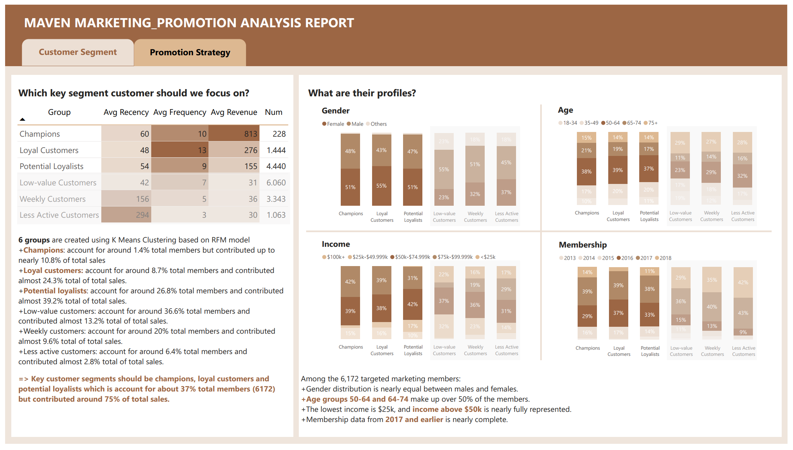

# maven_cafe_rewards_challenge
## Goal
Identify key Cafe Rewards customer segments and define offers that should used to target them effectively.  
Details of project: https://mavenanalytics.io/challenges/maven-rewards-challenge/404c6060-60eb-400f-9bce-c3b9f97e9d5a

## Aproach
Performed a K-Means customer segmentation analysis using RFM (recency, frequency, monetary) metrics. It involves:

(1) Data preparation  
(2) Data preprocessing  
(3) Data analysis based on key questions:  
+ Which customers are the most effective target?
+ What demographic profile do targeted customers have?
+ Which type of promotion are the most effective to key customer segments?
  
(4) Data visualization consists of 2 pages:  
+ Customer segment  
+ Promotion strategy
  
*Attached link: https://lnkd.in/gTD2A85G*

## Results
I am honored to earn an honorable mention for the first time of participation.
https://www.linkedin.com/feed/update/urn:li:activity:7242555651149733889/
